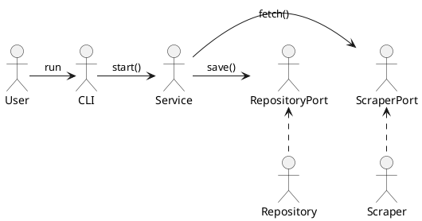
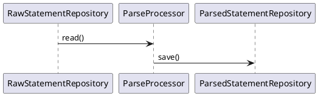
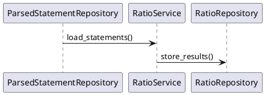

# Architecture

## Purpose and Scope
FLY collects and processes financial documents from companies listed on the stock exchange.

**In scope**

- Company listing and detail capture.
- NSD (sequential document) synchronization.
- Mapping DTOs to ORM models via repositories.
- Service orchestration using use cases.
- Resolving duplicate raw statement versions before transformation.

**Out of scope**

- Graphical user interfaces.
- Real-time or streaming updates.
- Sources other than the official exchange.

## Domain Model Overview
The system applies Domain-Driven Design elements to model financial data.

### Entities
- [`infrastructure/models/company_data_model.py`](infrastructure/models/company_data_model.py) stores company records and maps to [`domain/dto/company_data_dto.py`](domain/dto/company_data_dto.py).
- [`infrastructure/models/parsed_statement_model.py`](infrastructure/models/parsed_statement_model.py) groups standardized financial statements defined in [`domain/dto/parsed_statement_dto.py`](domain/dto/parsed_statement_dto.py).

### Value Objects
- [`domain/dto/metrics_dto.py`](domain/dto/metrics_dto.py) captures execution metrics as an immutable data structure.
- Identifiers such as tickers and CNPJ values in [`domain/dto/company_data_dto.py`](domain/dto/company_data_dto.py) behave as value objects validated by the domain layer.

### Aggregates
- A parsed statement together with its related rows (`infrastructure/models/statement_rows_model.py`) forms an aggregate representing a full financial report.

## Application Architecture
FLY follows Hexagonal Architecture, dividing responsibilities into four layers:

```
Presentation ↔ Application ↔ Domain ↔ Infrastructure
```

- **Presentation** – CLI controller at [`presentation/cli.py`](presentation/cli.py) that wires dependencies and starts flows.
- **Application** – Services and processors under [`application/`](application) orchestrate use cases without infrastructure details.
- **Domain** – DTOs and ports in [`domain/dto`](domain/dto) and [`domain/ports`](domain/ports) express business rules and contracts.
- **Infrastructure** – Adapters, repositories, and scrapers in [`infrastructure/`](infrastructure) implement external integrations.

Dependencies flow inward: presentation → application → domain. Infrastructure implements ports from the domain but never depends on the application layer.

## Design Patterns in Use
- **DTO** – Immutable transport objects defined in `domain/dto`.
- **Repository** – Ports in `domain/ports` with SQLAlchemy implementations under `infrastructure/repositories`.
- **Service** – Coordinators in `application/services` exposing `run()` or domain-specific methods.
- **Controller** – Entry point in `presentation/cli.py`.
- **Port and Adapter** – Interfaces in the domain with concrete adapters in infrastructure.

## Processing Flows

### Capture


### Standardization


### Ratios


## Traceability
Key components by layer:

| Component | Layer | Path |
| --- | --- | --- |
| `CLIAdapter` | Presentation | [`presentation/cli.py`](presentation/cli.py) |
| `CompanyDataService` | Application | [`application/services/company_data_service.py`](application/services/company_data_service.py) |
| `CompanyDataDTO` | Domain | [`domain/dto/company_data_dto.py`](domain/dto/company_data_dto.py) |
| `SqlAlchemyCompanyDataRepository` | Infrastructure | [`infrastructure/repositories/company_repository.py`](infrastructure/repositories/company_repository.py) |

